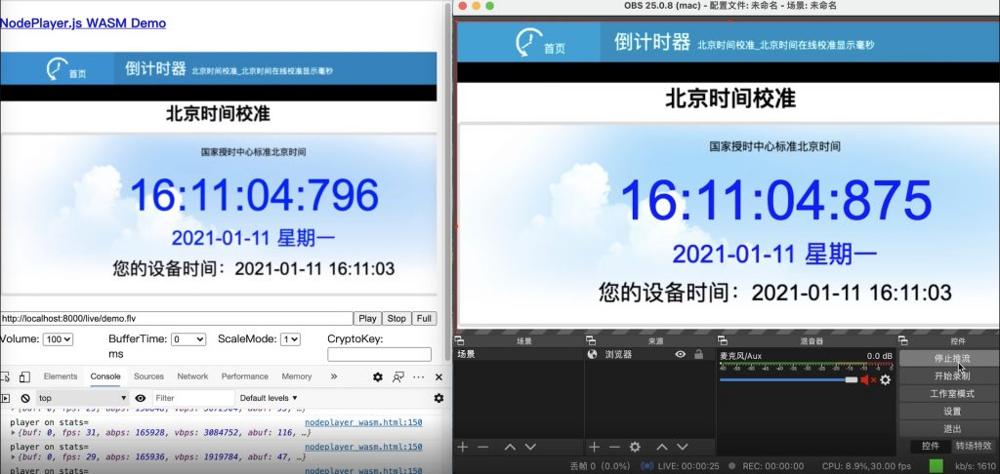

# 挑战播放1080p live-http-flv 100毫秒级延迟

要挑战100毫秒级的p2s2p型直播，我们首先要了解延迟到底是怎么产生的？

1.推流端p采集原始画面，交给编码器编码，根据编码复杂度，编码器缓存，在这里就产生了延迟。（可控参数较多，影响较大）
2.推流端p编码后推送到s服务端，网络传输产生延迟。（以现在的网络环境，影响小）
3.服务端s接收到视频后进行协议转换，不同的服务实现可能会在这里造成一点延迟。（以现在的服务端性能，影响小）
4.播放端p播放，网络传输产生延迟。（以现在的网络环境，影响小）
5.播放端p解码渲染、缓冲队列产生延迟。（音视频同步、数据缓冲、延迟消除算法复杂，影响很大）

由此可以看出，要实现低延迟，重点优化推播两端是效果最明显的。测试环境：

- OBS设置x264软编码，CBR，2500kbps, veryfast，zerolatency，baseline，1s gop，0 buffer，视频尺寸1920×1080@30
- 推流到本机NMS-v3.7.3 （忽略网络对延迟的影响，测试极限条件）
- NodePlayer.js-v0.5.56, bufferTime设置为0

实测，最低延迟79毫秒！

<video width="976" controls="" src="./video/QQ20210111-161110-HD-1.mp4"></video>

注意，当bufferTime设置为0，则意味着不再依靠时间戳进行平滑播放与音视频同步，也没有缓冲区来应对网络抖动。接入互联网后的网络抖动，可能会造成顿挫感。使用该设置的用户对视频低延迟的需求大于视频平滑度则可以进行尝试。